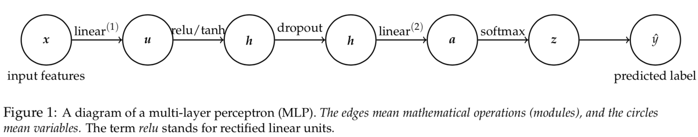

# Neural-Network-to-Classify-Handwritten-Digits
A Neural Network implementation, designed from scratch, to classify the MNIST Database of Handwritten Numbers

# Description
This is an implementation of a Neural Network Deep Learning Model, (designed from the groud up, without using existing libraries) to identify and classify Handwritten digits from the MNIST Dataset.

This particular implementation is based on the multi-layer perceptron (MLP, just another term for fully connected feedforward networks), which is shown as following. It is designed for a K-class classification problem.

# MLP Definitions
Let  (x∈ℝD,y∈{1,2,⋯,K})  be a labeled instance, such an MLP performs the following computations:

For a  K -class classification problem, one popular loss function for training (i.e., to learn  W(1) ,  W(2) ,  b(1) ,  b(2) ) is the cross-entropy loss. Specifically we denote the cross-entropy loss with respect to the training example  (x,y)  by  l :

Note that one should look at  l  as a function of the parameters of the network, that is,  W(1),b(1),W(2)  and  b(2) . For ease of notation, let us define the one-hot (i.e., 1-of- K ) encoding of a class  y  as:

    

so that

    

We can then perform error-backpropagation, a way to compute partial derivatives (or gradients) w.r.t the parameters of a neural network, and use gradient-based optimization to learn the parameters.
